<meta name="viewport" content="width=device-width, initial-scale=1">
<meta name="color-scheme" content="light dark">

# Spencer Kirsch: Mechanical Engineering Portfolio

- [Spencer Kirsch: Mechanical Engineering Portfolio](#spencer-kirsch-mechanical-engineering-portfolio)
- [Computational Fluid Dynamics Projects](#computational-fluid-dynamics-projects)
  - [Automotive Oil Heat Exchanger](#automotive-oil-heat-exchanger)
    - [Design Constraints](#design-constraints)
    - [Setup](#setup)
    - [Results](#results)
    - [Figures](#figures)
  - [Axial Air Compressor](#axial-air-compressor)
    - [Design Constraints](#design-constraints-1)
    - [Setup](#setup-1)
    - [Results](#results-1)
    - [Figures](#figures-1)
      - [Stage 1 — Baseline Flow](#stage-1--baseline-flow)
      - [Stage 4 — Downstream Development](#stage-4--downstream-development)
- [Finite Element Analysis Projects](#finite-element-analysis-projects)
  - [Wind Turbine Tower](#wind-turbine-tower)
    - [Design Constraints](#design-constraints-2)
    - [Setup](#setup-2)
    - [Results](#results-2)
    - [Figures](#figures-2)
  - [Turducken Thermal Analysis](#turducken-thermal-analysis)
    - [Design Constraints](#design-constraints-3)
    - [Setup](#setup-3)
    - [Results](#results-3)
    - [Figures](#figures-3)
- [Contact Me](#contact-me)

---

# Computational Fluid Dynamics Projects

## Automotive Oil Heat Exchanger

### Setup
- Modeled in Ansys Fluent as a crossflow heat exchanger with internal oil flow and perpendicular air flow.  
- Designed for compact engine oil cooling
- Oil and air inlets defined as velocity boundaries with pressure outlets.  
- Mesh was hex-dominant with local refinement around tube walls for heat transfer accuracy and y+ optimization.  
- Steady-state pressure-based solver using the k–ε turbulence model.  
- Oil inlet temperature: 350°F, Air inlet: 110°F  
- Oil flow rate: 6 gpm, Air velocity: 27 mph  

### Results
- Oil outlet temperature reached 271°F, removing approximately 28 Btu/s of heat  
- Increasing the tubing length by 1.5–2× would reduce oil outlet temperature to around 240°F while maintaining compactness  
- Oil and Air pressure drop measured 5.5 psi and 0.18 psi respectively
- Flow fully developed across the exchanger with no significant recirculation zones  
- Air outlet temperature reached about 139°F
- Compact form factor (10 × 6 × 3 in) satisfied packaging limits while providing good scalability  

---

### Figures

#### Geometry and Design

<figcaption style="text-align:center;">Initial duct layout for oil and air channels</figcaption>

<figcaption style="text-align:center;">Finalized crossflow heat exchanger geometry</figcaption>

#### Meshing and Model Setup
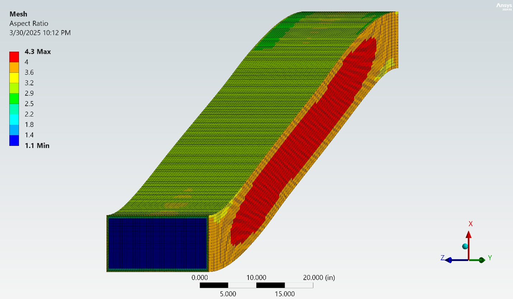
<figcaption style="text-align:center;">Duct meshing and boundary layer refinement</figcaption>

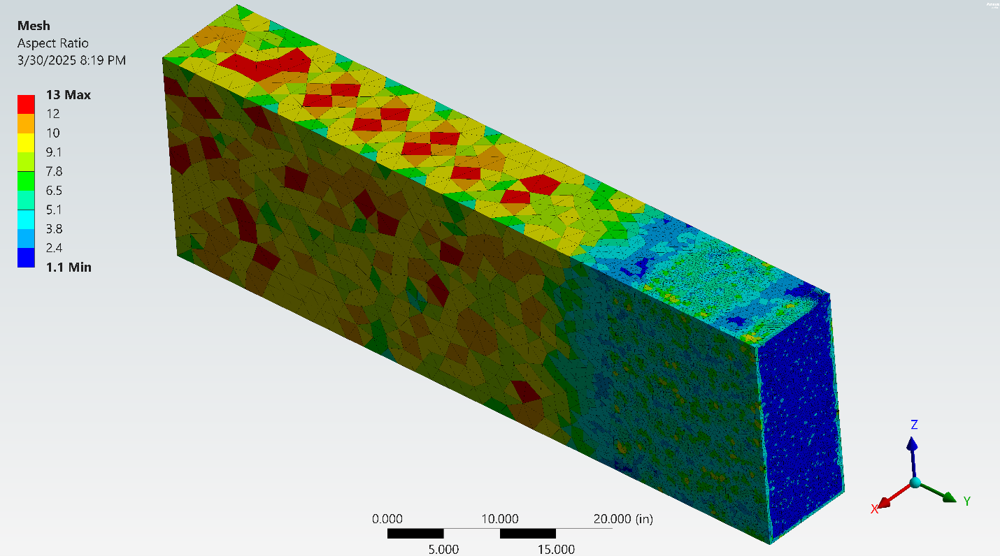
<figcaption style="text-align:center;">Heat exchanger overall mesh configuration</figcaption>

<figcaption style="text-align:center;">Developed flow mesh region</figcaption>

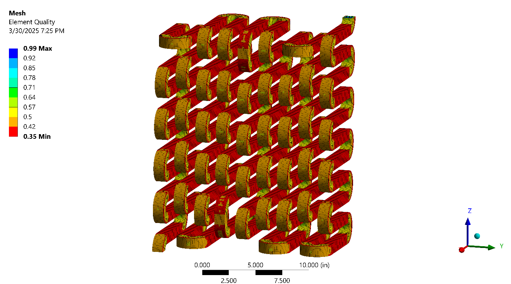
<figcaption style="text-align:center;">Final tubing mesh refinement</figcaption>

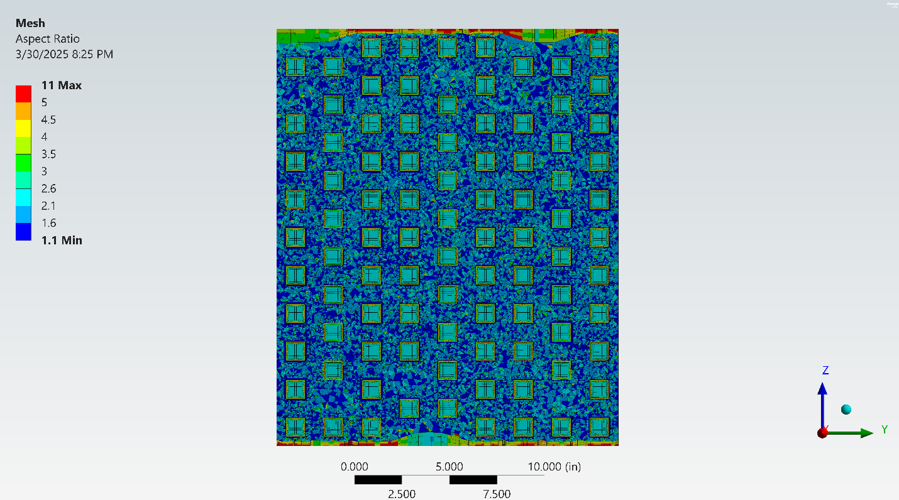
<figcaption style="text-align:center;">Cross section of tube mesh</figcaption>

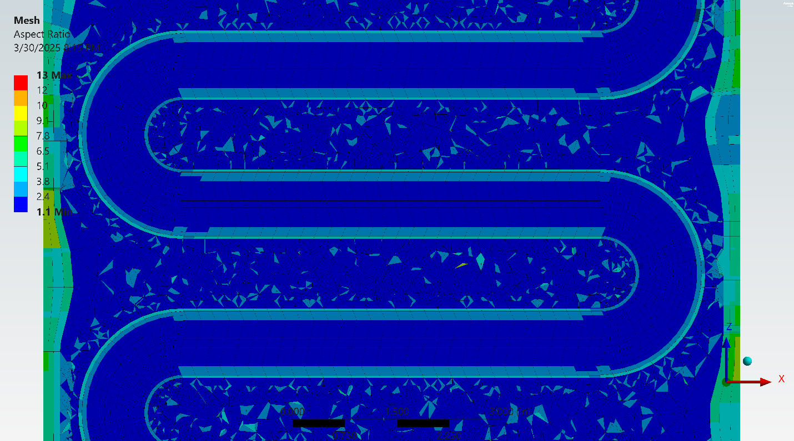
<figcaption style="text-align:center;">Mesh aspect ratio in pipe section</figcaption>

<figcaption style="text-align:center;">Mesh aspect ratio near oil inlet</figcaption>

#### Flow and Thermal Results

<figcaption style="text-align:center;">Temperature contour showing oil-to-air heat transfer</figcaption>

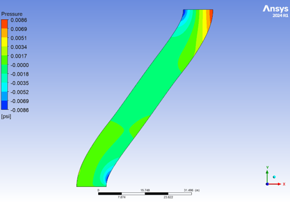
<figcaption style="text-align:center;">Pressure distribution through inlet and outlet ducts</figcaption>

<figcaption style="text-align:center;">Symmetric pressure field across heat exchanger core</figcaption>

<figcaption style="text-align:center;">Velocity vector field at symmetry mid-plane</figcaption>

#### Performance and Temperature Tracking

<figcaption style="text-align:center;">Air outlet temperature across exchanger length</figcaption>

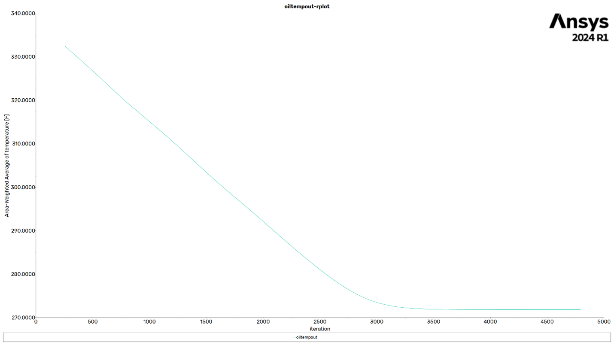
<figcaption style="text-align:center;">Oil outlet temperature distribution</figcaption>

---

## Axial Air Compressor

Designed and simulated a multi-stage axial compressor capable of achieving a 20:1 pressure ratio at 40,000 ft.  
Simulations were performed in ANSYS Fluent using detailed stage-by-stage geometry and validated at both altitude and sea-level conditions.

### Design Constraints
- Pressure ratio: 20 : 1  
- Maximum RPM: 50,000  
- Altitude: 40,000 ft  
- Outer diameter: 5 – 6 ft  

### Results
- Achieved total 20 : 1 compression ratio across 17 stages 
- Average Stage efficiency 82%
- Convergece of Stable flow, Temperature, and  convergence at all operating conditions  
- Efficiency validated against analytical predictions  
- Turbulence modeling, residual analysis, and mesh verification  

### Setup and Simulation Details
- Modeled and simulated in ANSYS Fluent, with each stage analyzed independently.  
- Outlet conditions of each stage used as inlet conditions for the next.  
- Pressure-based transient solver in double precision with periodic rotor–stator interfaces.  
- Mesh: patch-conforming, 0.5 in body sizing, 3 inflation layers (1.2 growth rate), adaptive level 7.  
- Max aspect ratio ≈ 10, min element quality ≈ 0.14.  
- Operating pressure: 0 psi; inlet total pressure: 2.73 psi; total temperature: –19.9 °F.  
- Spool-up sequence:  
  - 1000 rpm, Δt = 1×10⁻⁴ s, 300 steps  
  - 2000 rpm, Δt = 5×10⁻⁵ s, 300 steps  
  - 2500 rpm, Δt = 5×10⁻⁵ s, 960 + 480 steps (steady state)  
- Achieved good convergence of residuals 
### Figures

#### Concept and Geometry

<figcaption style="text-align:center;">Initial Hand calcs</figcaption>

<figcaption style="text-align:center;">Axial compressor assembly model in Onshape — Translucent Shroud</figcaption>

<figcaption style="text-align:center;">First Stages CAD detail Translucent Shroud.</figcaption>

<figcaption style="text-align:center;">Cross Section View.</figcaption>

<figcaption style="text-align:center;">Top View.</figcaption>

#### Stage 1 — Baseline Flow
<video src="ME407/CFD_Air_Compressor/S1_press.mp4" controls muted playsinline preload="metadata" style="display:block;margin:auto;width:100%;max-width:720px;border-radius:6px;"></video>
<figcaption style="text-align:center;">Stage 1 pressure contour during operation</figcaption>

<video src="ME407/CFD_Air_Compressor/S1_temp.mp4" controls muted playsinline preload="metadata" style="display:block;margin:auto;width:100%;max-width:720px;border-radius:6px;"></video>
<figcaption style="text-align:center;">Stage 1 temperature during operation</figcaption>

<video src="ME407/CFD_Air_Compressor/S1_stream.mp4" controls muted playsinline preload="metadata" style="display:block;margin:auto;width:100%;max-width:720px;border-radius:6px;"></video>
<figcaption style="text-align:center;">Stage 1 velocity streamlines during operation</figcaption>

<figcaption style="text-align:center;">Stage 1 mesh with boundary layer with aspect ratio color gradient</figcaption>

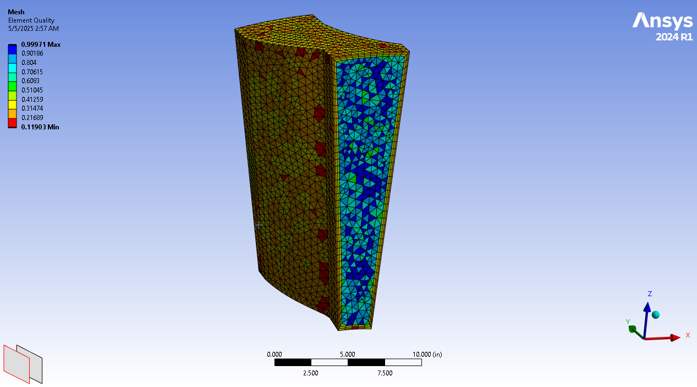
<figcaption style="text-align:center;">Stage 1 mesh with element quality displayed.</figcaption>

#### Stage 4 — Downstream Development
<video src="ME407/CFD_Air_Compressor/S4_press_anim.mp4" controls muted playsinline preload="metadata" style="display:block;margin:auto;width:100%;max-width:720px;border-radius:6px;"></video>
<figcaption style="text-align:center;">Stage 4 pressure contour during operation</figcaption>

<video src="ME407/CFD_Air_Compressor/S4_temp_anim.mp4" controls muted playsinline preload="metadata" style="display:block;margin:auto;width:100%;max-width:720px;border-radius:6px;"></video>
<figcaption style="text-align:center;">Stage 4 temperature during operation</figcaption>

<video src="ME407/CFD_Air_Compressor/s4_path_anim.mp4" controls muted playsinline preload="metadata" style="display:block;margin:auto;width:100%;max-width:720px;border-radius:6px;"></video>
<figcaption style="text-align:center;">Stage 4 velocity pathlines during operation</figcaption>

---

# Finite Element Analysis Projects

## Wind Turbine Structural Analysis

Ansys mechanical simulation of a wind turbine tower assembly under normal and extreme wind and thermal conditions. The objective was to determine the structural response, focusing on bolt stress, flange deformation, bending, and overall stability at the base connection.

### Design Constraints
- Tower height: 525 ft  
- Outer diameter (base): 40 ft  
- Material: structural steel (E = 29,000 ksi)  
- Normal Loading Case: 15 mph wind, ambient 75 °F  
- Extreme Loading Case: 100 mph wind, ambient 32 °F  
- Factor of safety target: ≥ 2.0  

### Results
- Peak Von Mises stress occurs near bolt holes on the baseplate under extreme wind conditions.  
- Maximum deformation at flange connection with acceptable displacement.  
- All critical regions remained under material yield stress.  
- Stress contours visually align with load direction

### Setup and Simulation Details
- Modeled in ANSYS Static Structural.  
- Boundary conditions applied for compression constraint on a fixed base and distributed wind load.  
- Mesh refinement around flange, bolt holes, and fillet regions.  
- Loading scenario for both normal and extreme cases.
### Figures

#### Geometry and Meshing
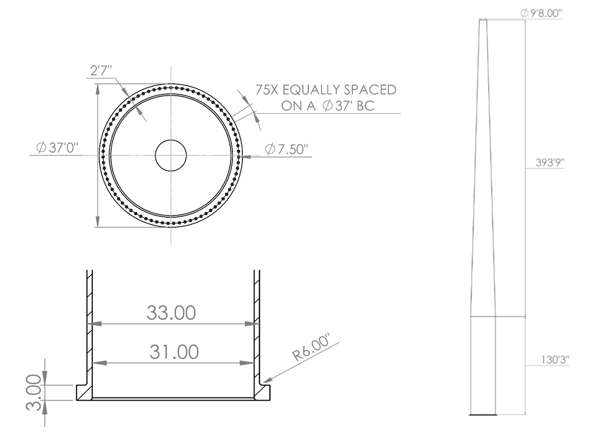
<figcaption style="text-align:center;">Turbine assembly dimensions and geometry</figcaption>

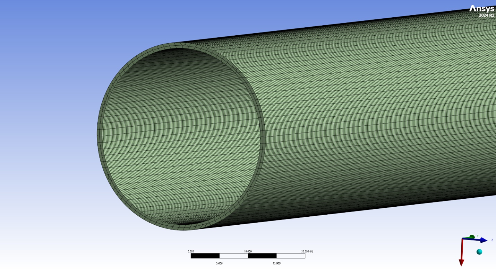
<figcaption style="text-align:center;">Base region mesh refinement</figcaption>

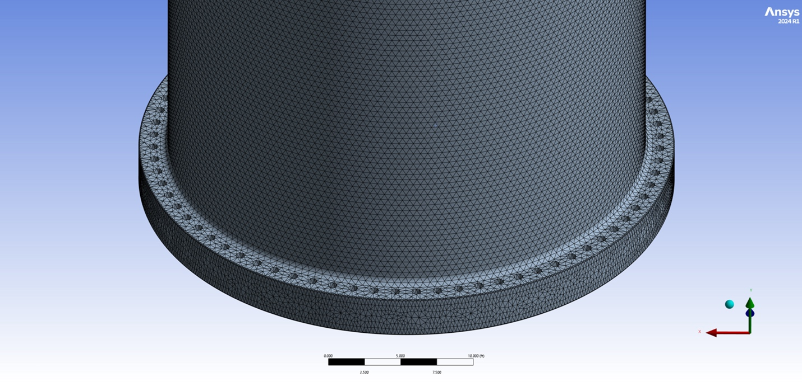
<figcaption style="text-align:center;">Flange connection mesh</figcaption>

<figcaption style="text-align:center;">Tip section mesh detail</figcaption>

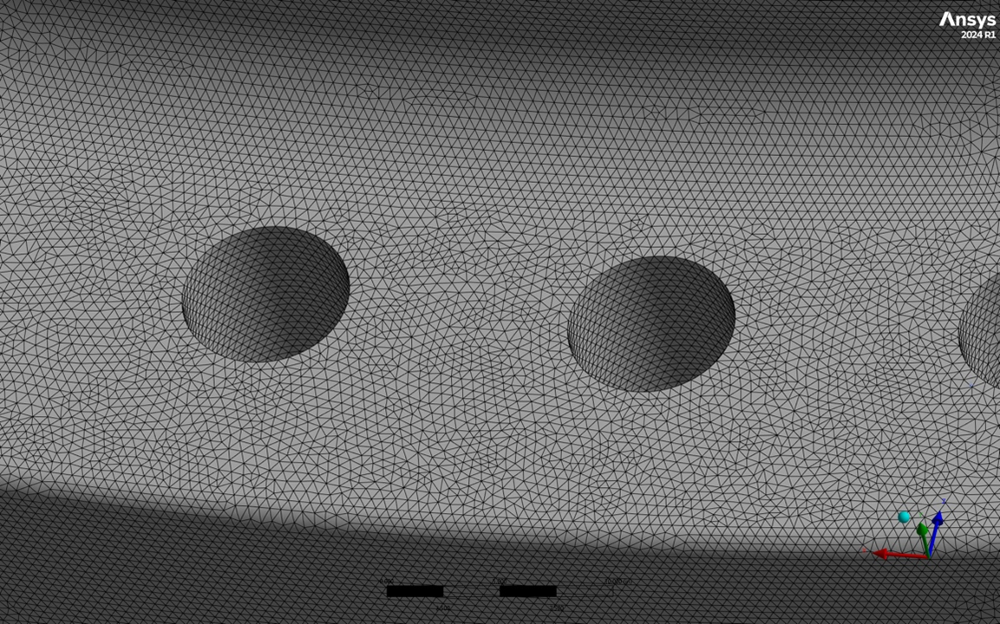
<figcaption style="text-align:center;">Tetrahedral mesh quality near bolt holes</figcaption>

<figcaption style="text-align:center;">Tetrahedral mesh cross-section</figcaption>

#### Boundary Conditions

<figcaption style="text-align:center;">Baseplate mesh around bolt holes</figcaption>

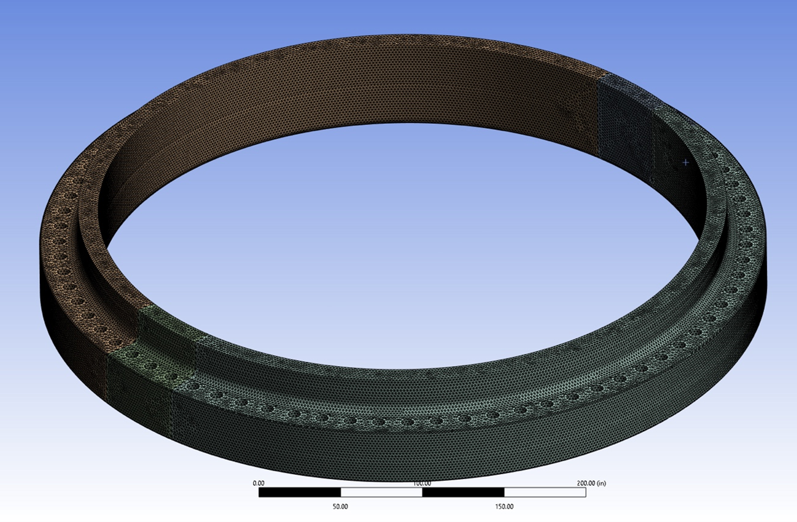
<figcaption style="text-align:center;">Baseplate mesh overview</figcaption>

<table style="width:100%;border-collapse:collapse;margin:auto;">
  <tr>
    <td style="width:50%;text-align:center;vertical-align:top;">
      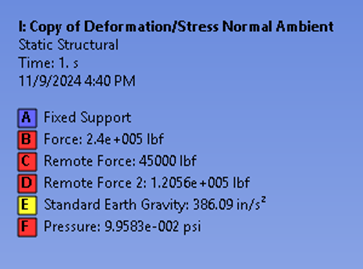
      <figcaption style="text-align:center;">Boundary condition under normal load (left)</figcaption>
    </td>
    <td style="width:50%;text-align:center;vertical-align:top;">
      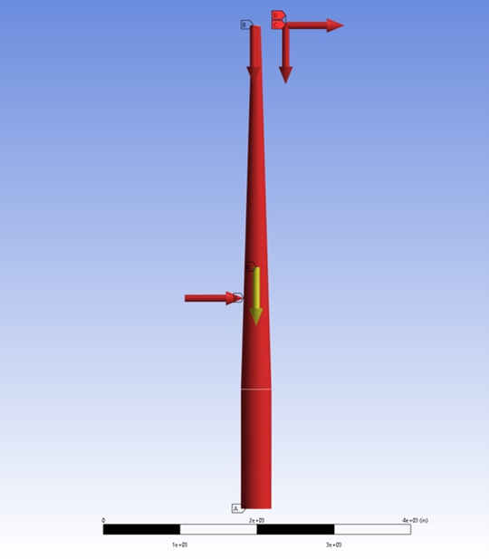
      <figcaption style="text-align:center;">Boundary condition under normal load (right)</figcaption>
    </td>
  </tr>
</table>

<table style="width:100%;border-collapse:collapse;margin:auto;">
  <tr>
    <td style="width:50%;text-align:center;vertical-align:top;">
      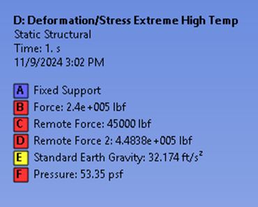
      <figcaption style="text-align:center;">Boundary condition under extreme wind load (left)</figcaption>
    </td>
    <td style="width:50%;text-align:center;vertical-align:top;">
      
      <figcaption style="text-align:center;">Boundary condition under extreme wind load (right)</figcaption>
    </td>
  </tr>
</table>

#### Von Mises Stress (Extreme Case)
<table style="width:100%;border-collapse:collapse;margin:auto;">
  <tr>
    <td style="width:50%;text-align:center;vertical-align:top;">
      
      <figcaption style="text-align:center;">Von Mises stress distribution (left view)</figcaption>
    </td>
    <td style="width:50%;text-align:center;vertical-align:top;">
      
      <figcaption style="text-align:center;">Von Mises stress distribution (right view)</figcaption>
    </td>
  </tr>
</table>

<figcaption style="text-align:center;">Baseplate stress under extreme wind load</figcaption>

<figcaption style="text-align:center;">Localized baseplate stress around bolt hole (extreme case)</figcaption>

#### Deformation (Extreme Case)
<table style="width:100%;border-collapse:collapse;margin:auto;">
  <tr>
    <td style="width:50%;text-align:center;vertical-align:top;">
      
      <figcaption style="text-align:center;">Deformation contour (left side, extreme case)</figcaption>
    </td>
    <td style="width:50%;text-align:center;vertical-align:top;">
      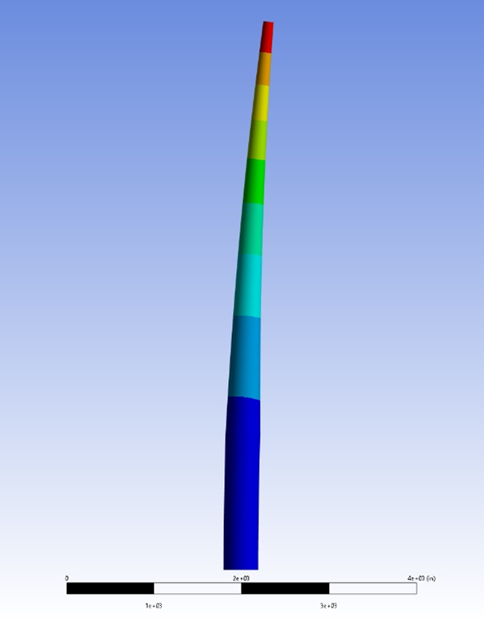
      <figcaption style="text-align:center;">Deformation contour (right side, extreme case)</figcaption>
    </td>
  </tr>
</table>

#### Summary Table
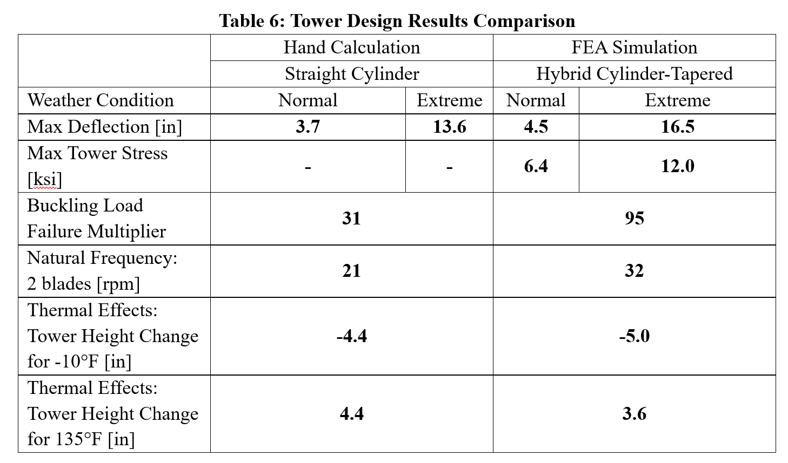
<figcaption style="text-align:center;">Summary of hand calc v. simulation maximum stress, deformation, natural frequency, and buckling</figcaption>
---

## Turducken Thermal Analysis

A thermal conduction and convection analysis modeling heat transfer in a multi-layered “turducken,” combining turkey, duck, chicken, and stuffing layers. The goal was to design a resistive skewer heating system that ensured uniform cooking and minimized surface overburn. Simulations were performed using ANSYS Mechanical, with additional gradient post-processing in MAPDL.

### Design Constraints
- Oven temperature: 350°F – 575°F  
- Initial internal temperature: 42°F  
- Max skewer diameter: 0.625 in  
- Skewer cross-section: ≤ 0.25 in²  
- Skewer heating: 125 W at 19.5 V  

### Results
- Achieved even heating across all layers with no overburn on the outer turkey layer.  
- Internal temperature uniformity reached within ±5°F of the target after ~90 minutes.  
- MAPDL post-processing accurately predicted burn percentage based on gradient thresholds.  
- Combined convective (outer) and conductive (skewer) heat transfer ensured complete cooking.  

### Setup and Simulation Details
- Modeled in **ANSYS Mechanical (Transient Thermal)** using temperature-dependent properties.  
- Mesh: ~150k elements, refined around the skewer and cavity interfaces.  
- Time step: 5 s, total simulation time ≈ 5400 s.  
- Boundary conditions: outer convection, skewer conduction, and layered contact interfaces.  
- Gradient-based post-processing performed in **MAPDL** for burn prediction.

### Figures

#### Hand Calculations and Results

#### Thermal Results and Gradient Mapping

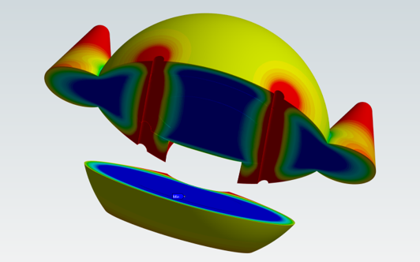
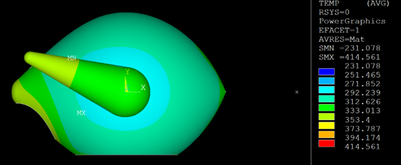

#### Meshing and Geometry

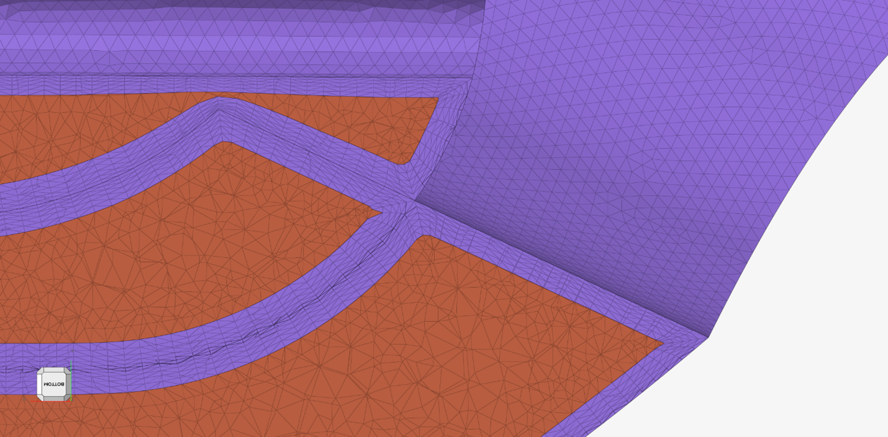

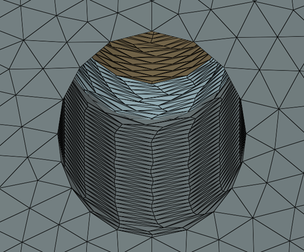

#### Boundary Conditions

#### Animation — Full Cooking Cycle
<video src="ME408/CAE_Turducken/ME408TurduckenAnimation.mp4" controls muted playsinline preload="metadata" style="display:block;margin:auto;width:100%;max-width:720px;border-radius:6px;"></video>
<figcaption style="text-align:center;">Transient simulation showing full cooking cycle with progressive heating and skewer conduction.</figcaption>

---

# Contact Me
- Email: [spencerkirh@gmail.com](mailto:spencerkirh@gmail.com)
- Location: New York, NY
- LinkedIn: *(Add link when ready)*

---
